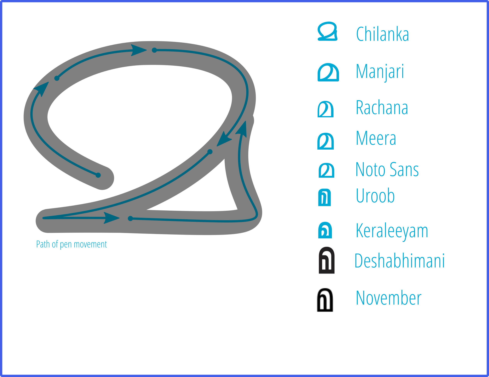

# ലിപിപരിണാമം നിലച്ചുപോയോ?

ബ്രാഹ്മിയിൽ നിന്ന് വട്ടെഴുത്തിടെ ആര്യനെഴുത്തിലൂടെ മലയാളത്തിലെത്തിയ ലിപികളുടെ പരിണാമങ്ങൾ അച്ചടിയിലെത്തിയപ്പോൾ നിലച്ചുപോയോ എന്നൊരാശങ്ക നിലവിലുണ്ട്. കയ്യെഴുത്തിന്റെ വഴക്കത്തിലൂടെയുള്ള പരിണാമം അച്ചുകളുടെ നിയതവും ശൈലികളുടെ വൈവിധ്യത്തിലെ എണ്ണക്കുറവും മൂലം ഉറച്ചുപോയെന്ന നിരീക്ഷണമാണ് ഇതിനുപിന്നിലുള്ളത്. അച്ചടിയിൽ നിന്നും ഡിജിറ്റൽ ചിത്രീകരണത്തിലെത്തിനിൽക്കുമ്പോഴും ഈ നിരീക്ഷണം സാധുവാണ്. ലിപിപരിണാമത്തിന്റെ വേഗത കുറഞ്ഞിട്ടുണ്ടെങ്കിലും അത് പാടെ നിലച്ചുപോയെന്ന് കരുതാനാകില്ല. 

അച്ചടിയുടെ മുമ്പുള്ള ലിപിപരിണാമത്തിന്റെ വാഹകർ ആ ലിപി എഴുതുന്ന എല്ലാവരുമായിരുന്നു. എഴുത്തിന്റെ വഴക്കവും എഴുത്തുകാരന്റെ സൗന്ദര്യബോധവും ഉപയോഗിക്കുന്ന എഴുത്തുപകരണങ്ങളുടെ ഉപയോഗസുഖവും എല്ലാം ഈ പരിണാമത്തിന് കാരണമായിരുന്നു. അച്ചടിയിലെത്തിയപ്പോൾ അച്ച് രൂപകല്പന ചെയ്യുന്നവരുടെ കയ്യിലേക്ക് ഇതൊതുങ്ങി. ഡിജിറ്റൽ കാലഘട്ടത്തിൽ ടൈപ്പ് ഫേസുകൾ രൂപകല്പന ചെയ്യുന്നവരുടെ എണ്ണത്തിലേക്കും ഒതുങ്ങി. അതുകൊണ്ടുതന്നെ ലിപിയുടെ എഴുത്തിലെ വൈവിധ്യങ്ങൾ വരുന്നത് ഈ ചുരുങ്ങിയ എണ്ണം ആളുകളിലേക്കെത്തി. പ്രചാരത്തിൽ മുന്നിലുള്ള പ്രസിദ്ധീകരണങ്ങളിലെ അക്ഷരരൂപങ്ങൾ ആ കാലഘട്ടത്തിലെ അക്ഷരങ്ങളുടെ പരിണാമത്തെ നിർണ്ണയിക്കാൻപോന്നവയാണ്. ഈ പ്രസിദ്ധീകരണങ്ങൾ ചെറുതും വലുതുമായ മാറ്റങ്ങൾ ലിപികളിൽ പ്രയോഗിക്കുന്നുണ്ട്, അവ ലിപിപരിണാമത്തെ മുന്നോട്ടുകൊണ്ടുപോകുന്നുമുണ്ട്.

ഇതിൽ ഒരുദാഹരണം ങ്ങ എന്ന കൂട്ടക്ഷരത്തിന്റെ തുടക്കത്തിലെ ചുറ്റിലുള്ള കുനിപ്പിനെക്കുറിച്ചുള്ളതാണ്. മലയാളമനോരമയുടെ തലക്കെട്ടുകളിൽ ഉപയോഗിക്കുന്ന ഫോണ്ടുകളിൽ ആ കുനിപ്പ് ഇല്ല. മഞ്ജരി ഫോണ്ടിലും ഇതില്ല. 

മ എന്ന അക്ഷരത്തിന്റെ രൂപം വളരെയേറെ മാറിവരുന്നതായി കാണുന്നു. ഒരു ആർച്ചിനിടയിലെ വലത്തോട്ട് ചെരിഞ്ഞ വെട്ട് 

അച്ചടിയിൽ കാണുന്ന ഇത്തരം മ കളിൽ ചിലത് പേനകൊണ്ട് എഴുതാൻ ബുദ്ധിമുട്ടാണ്. ഈ രൂപം കണ്ട് അതുപോലെ വരച്ചുവെയ്ക്കാൻ ശ്രമിച്ചാൽ പലരും പലരീതിയിൽ മ എഴുതും. ബ്രാഹ്മിയിൽ നിന്ന് വട്ടെഴുത്തിലേയ്ക്ക് വന്ന മ യുടെ ഇതുപോലെ പല ഘട്ടങ്ങളിലൂടെ കടന്നുപോയതാണെന്ന് കാണാം

### For unambigous data and visual representation

റ്റ എന്ന കൂട്ടക്ഷരം ററ എന്ന നിരത്തിയെഴുതിയ ശൈലിയിൽ നിന്നും അടുക്കിയെഴുതുന്ന ശൈലിയിലേക്ക് മാറിവരുന്നുണ്ട്. ഇതിന് ഒന്നാമത്തെ കാരണം ററ എന്ന നിരത്തിയെഴുത്തിൽ വായനയ്ക്ക് വരുന്ന ആശയക്കുഴപ്പമാണ്. ലാറ്റിൻ വാക്കുകൾ നമ്മുടെ നിത്യോപയോഗത്തിൽ ലിപ്യന്തരണം ചെയ്തുപയോഗിക്കുന്ന ഇക്കാലത്ത് മീറററ് എന്നെഴുതിയാൽ ആശയക്കുഴപ്പമില്ലാതെ വായിക്കാനാകില്ല. ഇതൊഴിവാക്കാൻ റ്റ എപ്പോഴും അടുക്കിത്തന്നെ എഴുതുന്ന രീതിയിലേക്ക് അച്ചടി മാറുന്നുണ്ട്. രണ്ടാമതായി ഡിജിറ്റൽ ഫോണ്ടുകൾ പഴയലിപി/പുതിയലിപി ഭേദമില്ലാതെ ഇവയെ അടുക്കിത്തന്നെ ചിത്രീകരിക്കുന്നുണ്ട്. കാഴ്ചയിൽ ഒരുപോലെയിരിക്കുകയും എന്നാൽ ഡാറ്റയിൽ വെവ്വേറെയായിരിക്കുകയും ചെയ്യുന്ന വാക്കുകൾ സൈബർസുരക്ഷാപ്രശ്നങ്ങൾ ഉണ്ടാക്കുകയും ചെയ്യും.

റ്റയുടെ കാര്യംപോലെത്തന്നെയാണ് ന്റ. 

ള്ള എന്നെഴുതുമ്പോൾ ആദ്യത്തെ ളയുടെ വാല് രണ്ടാമത്തെ ളയെ തൊടുന്ന രീതിയിലും അവതമ്മിലുള്ള അകലം കുറച്ചുമാണ് ഇന്ന് ഫോണ്ടുകൾ ചിത്രീകരിക്കുന്നത്. ഡിജിറ്റൽ ഉള്ളടക്കത്തിൽ ആശയക്കുഴപ്പമുണ്ടാക്കുന്നത് സുരക്ഷാപ്രശ്നങ്ങൾ ഉണ്ടാക്കുമെന്നതുകൊണ്ട് ഇന്നത്തെ കാലത്ത് ഇത് വളരെ പ്രധാനപ്പെട്ടതുമാണ്.

### Latinization of script 

- For the uninitiated, Latinisation occurs when designers take the familiar As Bs and Cs used in English \(and other languages\) as their point of reference in designing other writing systems. The Latin script has undergone much evolution over the centuries, and its rich typographic heritage can easily spill over onto writing systems with different conventions. This overspill could amount to the borrowing of stylistic details like serifs, copy-pasting the same arches between different scripts, or even reappropriating entire letters. In a less obvious sense, it can also amount to the way a typographic family is set up with bold and italic styles being propagated onto scripts where they are alien, or re-proportioning a script to work in typographic environments that were set up to accommodate Latin.





ഡിജിറ്റൽ അക്ഷരരൂപങ്ങളുടെ നിർമിതി ആയാസരഹിതമായിക്കൊണ്ടിരിക്കുകയാണ്. അത് കൂടുതൽ ഡിസൈനർമാരെ ഈ മേഖലയിലുണ്ടാക്കുകയും അവരുടെ പരീക്ഷണങ്ങൾ ലിപിയിൽ ചലനങ്ങൾ ഉണ്ടാക്കുകയും ചെയ്യും. സ്വന്തം കൈപ്പടതന്നെ ഫോണ്ടായി ഉപയോഗിക്കാവുന്ന കാലം വിദൂരമൊന്നുമല്ല.\(gives personal touch to what you write\).അതൊരുപക്ഷേ കൈയക്ഷരത്തിലൂടെ ലിപി പരിണമിച്ചിരുന്ന പഴയകാലത്തേക്ക് നമ്മളെ എത്തിക്കുമോ?

### ഔദ്യോഗിക ലിപിപരിഷ്കരണങ്ങൾ

Popular typefaces will definitely will decide the style that survives through generations

{% embed url="https://thottingal.in/documents/Malayalam%20Orthographic%20Reforms\_%20Impact%20on%20Language%20and%20Popular%20Culture.pdf" %}

### പാഠ്യപദ്ധതി

പഴയലിപി പാഠ്യപദ്ധതിയിൽ പഠിപ്പിക്കാതിരിക്കുകയും അതേ സമയം പാഠ്യപദ്ധതിക്ക് പുറത്ത് നിരന്തരം പഴയലിപി കാണുകയും ചെയ്യുന്ന വിദ്യാർത്ഥികൾ എഴുത്തിലെ പാറ്റേണുകൾ മനസ്സിലാക്കുന്നിടത്തുള്ള ചില സവിശേഷതകൾ ലിപിയെ ചലിപ്പിക്കുമോ?



### പഴയ ലിപിയോ പുതിയലിപിയോ

സാങ്കേതികത്തികവും മിഴിവേകിയതും അതാത് കാലത്ത് ജനകീയമാകുന്നവയുമായ ഫോണ്ടുകൾ ആയിരിക്കും പുതിയകാലത്ത് ഇതിൽ സ്വാധീനം ചെലുത്തുക. പഴയലിപി പോയിട്ടേയില്ല.

