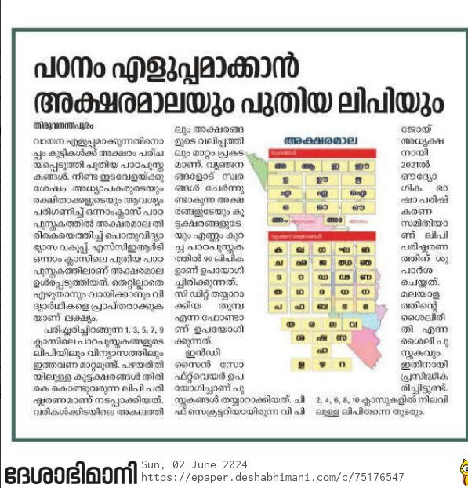

# Orthography

## മലയാളലിപിയുടെ സമഗ്രത

[https://chengazhi.ssus.ac.in/images/chengazhi-2.pdf](https://chengazhi.ssus.ac.in/images/chengazhi-2.pdf) മലയാളലിപിയുടെ സമഗ്രത - കെ എച് ഹുസൈൻ. ചെങ്ങഴി, കാലടി സംസ്കൃത സർവകലാശാല.

## How to use an old lipi font as new lipi font

.png>)

Using this line of css `font-feature-settings: "psts" off, "pres" off;` I turn off pstf - post base substitution used for u signs, ഋ sign. Then turn off pres-prebase substitution used for ്ര signs.

How fragile the old lipi and new arguments? - An old lipi font like Manjari can be quickly converted to new lipi font by just using a single line CSS. This is the power of opentype(only if used properly in a font). The aesthetics that the designer have in mind is valid only when it is used as per the default settings. Users are free to make it new lipi like this, provided they have technical know how.

This can be used in TeX too using the fontspec features. Here is an example of defining a new font with new lipi in XeLaTeX

```
\newfontfamily\malnewliipifont[Script=Malayalam, AutoFakeSlant=0.4, HyphenChar="00AD]{Manjari}[
Path=fonts/,
UprightFont=Manjari-Regular.ttf,
BoldFont=Manjari-Bold.ttf,
RawFeature=-pres;-psts
]
```

## Naming

പഴയ -പുതിയ തുടങ്ങിയ പ്രയോഗങ്ങൾക്ക് ലിപിയുടെ കാര്യത്തിൽ പ്രസക്തി നഷ്ടപ്പെട്ടതിനാൽ (കാലഗണനവെച്ച് ഇന്ന കാലത്ത് പ്രചാരത്തിലുണ്ടായിരുന്ന എന്ന അർത്ഥത്തിൽ), ലിപിയുടെ സ്വഭാവമനുസരിച്ച് പേരിടേണ്ടിയിരിക്കുന്നു. എന്റെ നിർദ്ദേശം:

**ചേർപ്പുലിപി** - കൂട്ടക്ഷരങ്ങൾ ധാരാളമായി ഉപയോഗിക്കുന്ന, ഉകാരചിഹ്നം വിട്ടെഴുതാത്താ, പഴയലിപിയെന്നു വിളിച്ചുവന്നിരുന്ന ലിപിയെ സൂചിപ്പിക്കുന്നു

**പിരിപ്പുലിപി** - ലിപിരൂപങ്ങൾ കുറവായ, പുതിയലിപിയെന്ന് വിളിച്ചിരുന്ന ലിപിയെ സൂചിപ്പിക്കുന്നു.



.png>)

.png>)

.png>)

.png>)

 (1) (1).png>)

Date 10 Feb 2022

 (1) (1).png>)

Date 10 Feb 2022

 (1) (1) (1).png>)

 (1).png>)

 (1).png>)

.png>)Mathrubhumi May 14, 2022

.png>)May 30 2022

<figure><figcaption><p>June 1 2024 Malayala Manorama</p></figcaption></figure>


<figure><figcaption><p>ദേശാഭിമാനിയുടെ അഭിപ്രായത്തിൽ പാഠപുസ്തകത്തിൽ 90 ലിപികളാണുള്ളത്.</p></figcaption></figure>

## Papers

* [The effect of script reform on levels of orthographic knowledge: Evidence from alphasyllabary Malayalam scripts](https://journals.plos.org/plosone/article?id=10.1371/journal.pone.0285781) Krithika Nambiar, Kiran Kishore, Pranesh Bhargava
*
