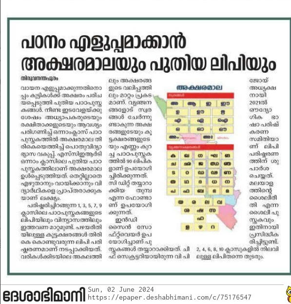

# Indesign

Adobe Indesign has Malayalam support in their CC versions since 2015. But compared to scribus or XeTeX , there are still unresolved issues. For CC versions till 2020, Adobe did not enable Indic script support by default. For that, you will need to follow the steps explained in this article:


[അഡോബി ഫോട്ടോഷോപ് സിസി, ഇലസ്റ്റ്രേറ്റർ സിസി, ഇൻഡിസൈൻ എന്നിവയിൽ യുണികോഡ് മലയാളം ഫോണ്ടുകൾ എങ്ങനെ ഉപയോഗിക്കാം ](https://smc.org.in/articles/adobe-unicode) - SMC website


In 2020 Adobe decided to move to Harfbuzz for text rendering instead of their legacy proprietary text rendering system. They have a tutorial on enabling Harfbuzz:  [Script for enabling Harfbuzz workflow in InDesign](https://community.adobe.com/t5/indesign/script-for-enabling-harfbuzz-workflow-in-indesign/td-p/11295166?page=1)

## Hyphenation

Indesign has automatic hyphenation. It can use the hyphenation rules I wrote.



Indesign CC 2018 comes with Hunspell hyphenation dictionaries. These hyphenation dictionaries are written by me long time back. See [https://github.com/smc/hyphenation](https://github.com/smc/hyphenation)

From menu Edit-&gt; Preferences-&gt;Dictionary, set Language and Hyphenation as “Hunspell”

Create a text frame and add content to it. Make sure that the composer is set as Adobe World-Ready paragraph composer. You can access it from Paragraph settings as shown below. Without this settings, the Indic text won’t render correctly.

Tick the “Hyphenation” from the paragraph settings. Select an appropriate font for the content. Choose the language of the content as Malayalam or other Indic language you are working on. See screenshot below. Justify the content.

The content will get automatically hyphenated. If you resize the column width or insert more content, text will get automatically hyphenated.

The exported PDF will look like:

You can see the hyphenation rules in Installation folder: C:\Program Files\Adobe\Adobe InDesign CC 2018\Resources\Dictionaries\LILO\Linguistics\Providers\Plugins2\AdobeHunspellPlugin\Dictionaries

Patterns are available for Assamese, Bengali, Panjabi, Gujarati, Assamese, Marathi, Tamil, Telugu, Odia, Kannada and Malayalam.

I have not tried older Indesign versions, so I don’t know from which version this feature is available. But I don’t see a reason for not using latest version either.

